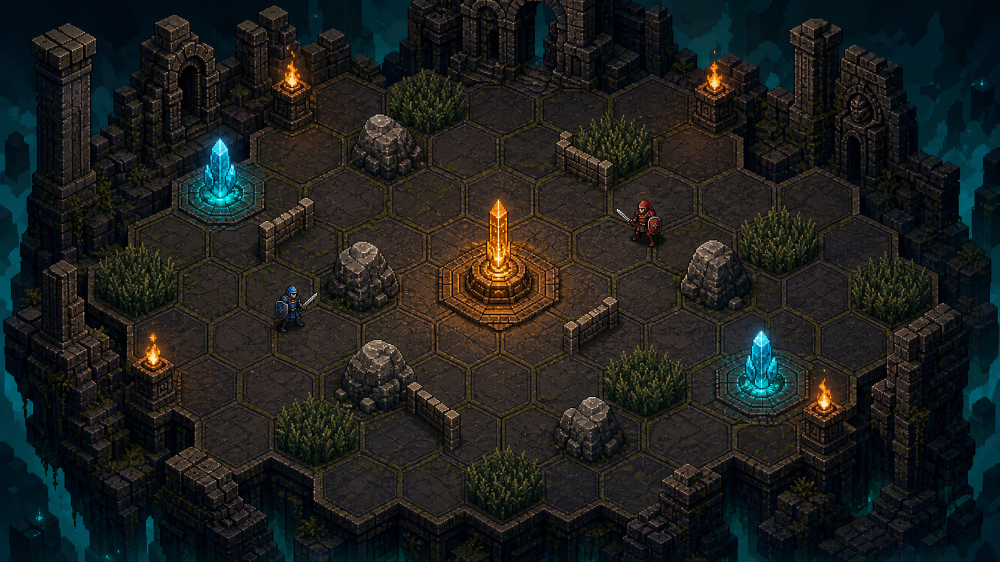

# Projekt Ji 像素竞技场：第一阶段美术设定

## 目标

将 8x8 六边形战场塑造成可读、可拼接、具有深色遗迹氛围的 16-bit 倾斜俯视场景。画面服务于回合制决策：玩家应在一眼内分辨可走地面、阻挡物、薄墙、草丛、据点、能量点和单位阵营。

本阶段只定义视觉语言与审核方向，不改变任何规则、界面或现有头像。

## 视觉基调

- **主题**：被遗忘的潮汐祭坛，悬于幽蓝深渊上的古代遗迹。
- **镜头**：三分之四倾斜俯视（近似 45 度），镜头不旋转；地图上方为远景，下方为前景。
- **像素感**：16-bit 细节密度，硬边像素簇、有限渐变、可见石材与苔藓纹理；避免平滑笔刷和摄影式模糊。
- **现有素材衔接**：保持 `pic/dungeon-floor.png` 的深棕灰石材、暗金边缘与苔藓缝隙；英雄头像保持为角色信息入口，战场内未来使用更小的像素单位。

## 网格与比例

- 战斗格为**无缝密铺的六边形**，边线必须完整且相邻格共享一条边。
- 单格建议制作基准为 **96x84 px**（含描边），运行时按整数倍缩放，禁止非整数缩放造成像素发糊。
- 格子边缘使用深灰描边和低亮度内缘；可走格不使用持续高亮，以免与地形信息争抢注意力。
- 单位脚底占用格子中心约 45% 到 55% 宽度；目标、移动和受击特效不得遮住相邻格边界。

## 调色板

| 用途 | 主色 | 辅色 | 使用原则 |
| --- | --- | --- | --- |
| 基础地面 | `#3a3531` | `#242324`、`#66584a` | 低饱和石材，保持最高面积占比。 |
| 遗迹边缘与巨石 | `#4c4844` | `#1c1c1e`、`#817264` | 明确轮廓，不能与普通地面混淆。 |
| 草丛 / 隐匿 | `#3c5a31` | `#1e3429`、`#779342` | 中低亮度，隐身状态可叠加轻微暗化。 |
| 能量水晶 | `#36d9ec` | `#0e6d91`、`#c4ffff` | 高亮冷色，仅用于能量与可收集魔法物。 |
| 据点 / 得分 | `#f2a23b` | `#8f451a`、`#fff0a3` | 高亮暖色，是场景第一焦点。 |
| 火把 | `#ffb33e` | `#c54e1b`、`#fff1bc` | 局部暖光，用于边缘引导而非照亮全场。 |
| 己方 / 敌方 | `#35b9ed` | `#df5846` | 仅用于单位脚环、细边、短暂效果；不要给整格染色。 |

## 场景层级

从后到前固定为：

1. 深渊、远景树影、断裂遗迹背景。
2. 悬空平台外沿、墙体、柱子和火把。
3. 六边形地面与格线。
4. 格内静态地形：草丛、巨石、据点、能量晶体。
5. 薄墙：仅沿共享边出现，不占用整个格子。
6. 单位、脚环、行动预览与伤害特效。
7. 短时出现的得分、攻击、状态标记。

前景墙体只允许遮挡场外边缘，不遮挡可点击格、单位或状态信息。

## 光照与可读性

- 环境光保持冷暗，照明逻辑使用“青色能量 + 暖色据点 / 火把”。
- 据点周围可以有 1 格范围的暖色地面反光；水晶只投射小范围青光。
- 草丛、巨石和薄墙的本体亮度必须低于据点、水晶和单位脚环。
- 单位的队伍色只出现于脚环、轮廓和极少量服装细节，确保头像风格不同的英雄也能快速识别阵营。
- 所有可交互格位在去掉特效后，仍可由边界、材质和轮廓辨认。

## 各地图元素

| 元素 | 视觉职责 | 方向 |
| --- | --- | --- |
| 六边形地面 | 提供清晰行动单位 | 裂纹玄武岩、细苔藓、深色共享边。 |
| 据点 | 地图主目标 | 中央祭坛或火焰信标，金橙色脉冲与环形符文。 |
| 能量点 | 次级资源目标 | 青色水晶从小型基座生长，冷光不超过相邻一格。 |
| 草丛 | 隐匿信息 | 厚实的低矮草簇，边缘可压住一点格线但不盖住整格。 |
| 巨石 | 不可进入地形 | 高于地面、灰色体块、投下短而硬的阴影。 |
| 薄墙 | 阻断边而非阻断格 | 低矮石砌墙或金属栅栏，仅画在两个格子的共同边上。 |
| 火把 | 叙事与边缘引导 | 放在外围遗迹柱旁，暖光与中心据点建立呼应。 |

## 禁止项

- 不使用方格、矩形地砖或有缝的六边形拼接。
- 不使用照片感材质、柔焦、实时景深、发光过曝或大面积霓虹。
- 不让大型装饰覆盖可走格、遮住单位或破坏行动距离判断。
- 不在地形上烙印坐标、文字、英雄名字或长期悬浮说明。
- 不用过度相似的颜色表达草丛、巨石、薄墙和普通地面。
- 不让火焰、水晶和据点同时达到同等亮度；据点应始终最优先。

## 本轮审核素材

该方向板验证：中央金色据点、两侧青色能量水晶、草丛、巨石、薄墙、火把与外围遗迹在同一画面内的层级关系。它是美术方向参考，不是最终 8x8 地图布局，也不直接作为游戏背景使用。

## 审核重点

1. 是否认可“深灰石材 + 青色能量 + 金橙据点”的明暗与色彩关系。
2. 六边形格线和倾斜视角是否足够直观，适合后续保留精确距离判定。
3. 草丛、巨石、薄墙在同屏时是否仍然容易辨认。
4. 据点作为第一视觉焦点是否符合游戏目标导向。

